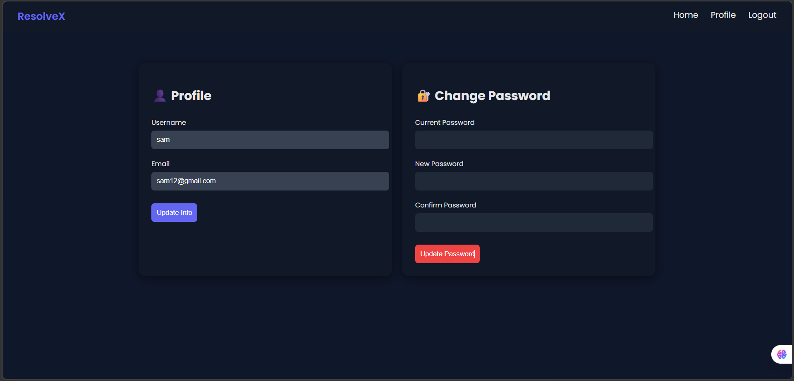
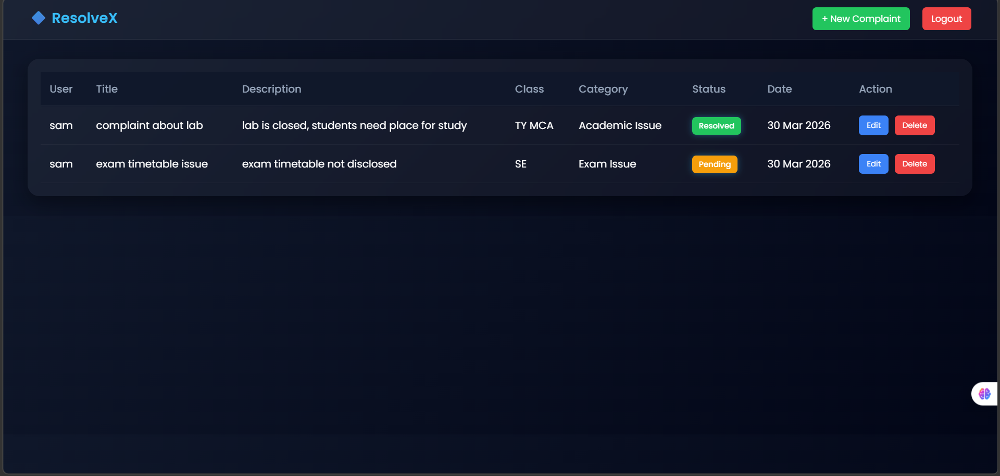
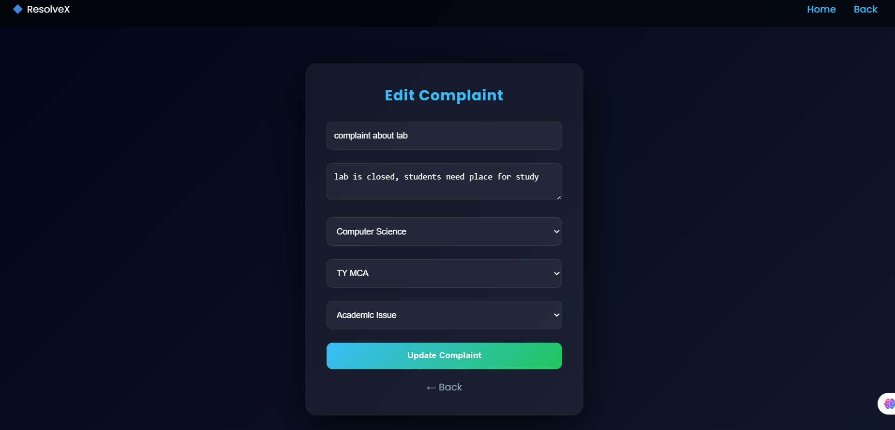

#  Complaint Management System

##  Overview

A web-based **Complaint Management System** built using **Django** and **MySQL** to submit, track, and manage complaints efficiently.

---

##  Features

* 🔐 User Authentication (Login/Register)
* 📝 Complaint Submission
* 🔄 Status Tracking (Pending / In Progress / Resolved)
* 🧑‍💼 Admin Dashboard
* 🔍 Search & Filter Complaints

---

##  Tech Stack

* Backend: Django
* Database: MySQL
* Frontend: HTML, CSS, JavaScript

---
## 📸 Screenshots

### 📝 Register Page

### 🔐 Login Page

### ℹ️ About Page

### 👤 User Profile

### 📋 View Complaints

### 📊 Complaint Dashboard

### ✏️ Update Complaint

## ⚙️ Setup

pip install -r requirements.txt
python manage.py migrate
python manage.py runserver

---

##  Security

* Password Hashing
* CSRF Protection
* Secure Authentication

---

##  Key Highlights

* Role-Based Access (User/Admin)
* Clean UI & Responsive Design
* Efficient Complaint Workflow

---

##  Future Scope

* Email Notifications
* Analytics Dashboard
* AI-based Complaint Classification

---

## 👩‍💻 Author

Vartika pandey

